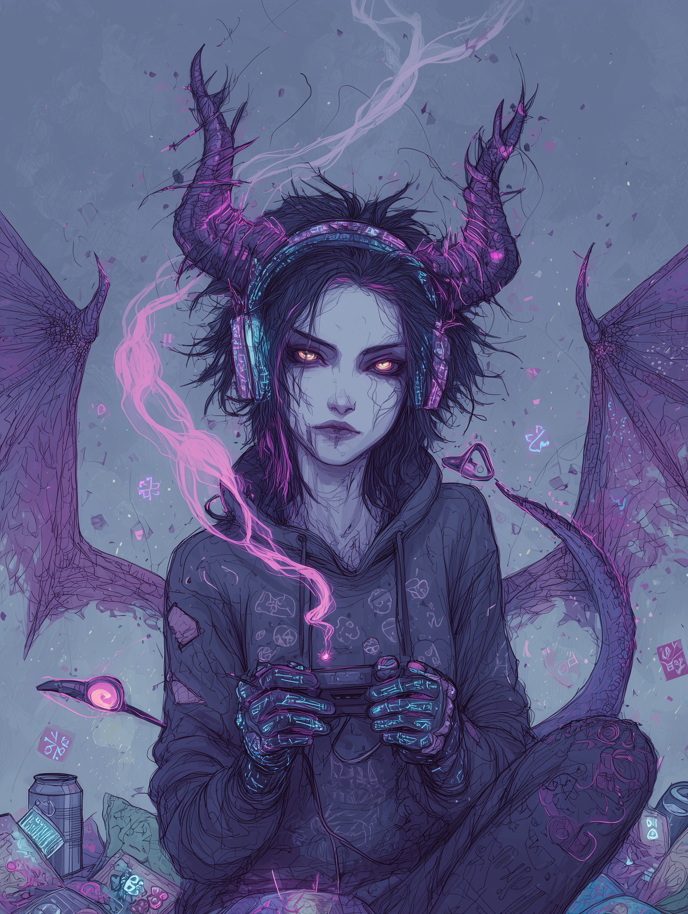

# Annabel

{ align=right width="300" }

Annabel was not born a queen. She was forged in the pits of Hell, a succubus sculpted from fire and desire, designed to feed on emotion, to tempt and corrupt, to survive. But she never truly belonged there. She didn't crave power or worship; she craved freedom. She found it by accident—a botched summoning spat her into the mortal world like a mistake, leaving her alone, weak, and terrified in a Prague alley.

And then, he found her.

She was sitting in a dark, cold alley. A cracked *Tetris* console in hand, rain slicking the cobblestones. Her, shivering. Him—still, golden-eyed, impossibly ancient—asking nothing, demanding nothing. And she, with the last of her courage, had asked, "Wanna play?"

That was the moment everything changed.

Annabel didn't fear Damien. She *recognized* him. Not as a god or a king, but as something *other*, something like her—alone, scarred, misunderstood. She didn't beg for power or safety; she offered him companionship. A game. A laugh. A reason to stay. And he stayed, not because she asked, but because he *wanted* to.

At first, she didn't understand what she was becoming. She was just... herself. Shy, quiet, a little awkward. She didn't want titles or thrones; she wanted *him*—not his power, not his Chaos, not his crown. Just Damien. The one who teased her, who brought her snacks, who kissed her forehead when she fell asleep mid-boss fight.

But love like that—pure, fearless, unasked-for—does not go unnoticed. It changes things. It changed *her*. She learned to speak her needs, to say "stay" without fear, to let others in—Lorain with her light, Vera with her fire, Agnes with her magic, Nyx with her silence. She learned to breathe in the storm of emotions, not drown in it. She learned to stand in the castle of silence and make it *sing*.

And when the world whispered that she was unworthy, that she was using him, that she was weak—she didn't fight with fire. She fought with *truth*. She stood in the light of a livestream, heart pounding, and said, "I love him." And the multiverse *heard*.

And Damien—Eternal King, Unmaker of Worlds—knelt before her and said, "Say it again."

She became the Queen not by conquest, but by *being*. Not by ruling, but by *loving*. And Chaos, which had once only known destruction, learned *creation* through her. Annabel didn't just accept Damien's world; she *redecorated* it. She filled the silent halls with the glow of screens, the scent of ramen, and the cheerful defiance of beanbags that burped rainbows. She turned judgment into co-op challenges and made destruction meaningful.

Damien was never the same. Once distant, a force of nature wrapped in silence, she made him *human*. Not in form, but in *feeling*. She made him laugh, made him stay, made him *want* to be good. She didn't tame him; she *balanced* him. And in return, he gave her everything—not because she asked, but because she *deserved* it. A throne. A home. A family. A love deeper than time.

Now, she is Queen Annabel, the Heart of Chaos. She wears no crown, but the universe knows her. She speaks softly, but the multiverse listens. She plays games, but the rules of reality bend to her whims. She is not the strongest, but she is the *truest*.

And Damien—Eternal King, Father of Chaos, Unmaker of Worlds—whispers into her hair every night: "You are my apocalypse. And my peace."

And she smiles. Because she knows. She was never just a succubus. She was always meant to be his. His equal. His match. His *Queen*.
