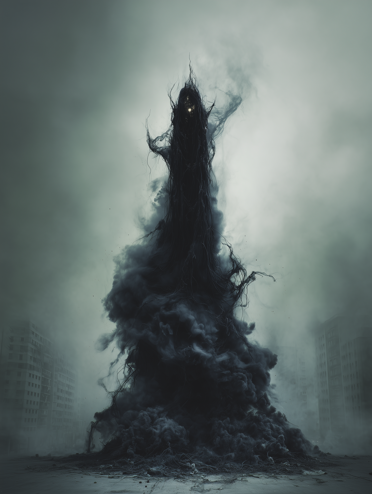

# Despair

{ align=right width="300" }

**October 14th.**

The water in the buckets is black now. It looks like oil, but it smells like rust and old bone. I stopped trying to filter it three days ago. If the radiation doesn't take me, the dysentery will. It's a gamble, but down here, gambling is the only thing that makes you feel alive.

That's the joke, isn't it? Feeling alive. When you're buried six feet under concrete and earth, "alive" is just a slow way of saying "dying."

I saw it again today. Not with my eyes. My eyes are useless down here; they've adjusted to the dark so well that the glow of my Geiger counter looks like a flashbang. But I felt it. Despair. It's not an emotion anymore. It's a physical presence. It's the fifth roommate in this shelter, the one who doesn't eat the rations but consumes the air instead.

If I were to describe it—this entity that squeezes through the ventilation shafts—it's not a monster with teeth. It's quieter than that. It feels like the exact moment the sirens stopped. Do you remember? The noise was deafening, a wall of sound that shook your teeth loose, and then... silence. That absolute, crushing silence when you realized the world hadn't ended with a bang, but with a whimper that you weren't allowed to answer.

Despair is that silence given weight.

I feel it pressing against the back of my neck when I try to sleep. It's cold, but not the kind of cold that makes you shiver. It's the cold of a space where stars used to be. It sits in the corner opposite the cot. I know it's there because the dust motes stop dancing in the dim light of the lantern. They just hang there, suspended, afraid to move.

It doesn't have a face. If I turned the lantern up, I know I wouldn't see anything. But if I close my eyes, I see the gray skin of a dead sky. I smell the ash of a million funeral pyres. It tastes like copper pennies in the back of my throat.

It talks, too. Not with words. Words have structure. Words have grammar, beginnings, and ends. This thing doesn't have ends. It hums. It's a low-frequency vibration that rattles the fillings in my teeth. It sounds like the groan of metal under heat, like the skyscrapers twisting before they fell. It asks a question, over and over again. It asks, *"Why?"*

Why did you run? Why did you hide? Why do you keep breathing when the lungs of the world are scorched?

I tried to argue with it yesterday. I screamed at the corner. I said, "Because I'm human! Because I survive!"

It didn't get angry. It just got heavier. The air in here turned to syrup. I couldn't lift my arms. It showed me then—not an image, but a sensation. It showed me the futility of the survival instinct. It showed me that the cockroaches in the walls are better at this than I am. It showed me that the victory of life is just a delay of the inevitable.

Despair is the realization that the story has already been written, and the last page is blank.

It's sitting closer now. I can feel its shadow stretching across the floor, inching toward my boots. It's curious. It wants to know what it feels like when hope finally breaks. It wants to measure the exact decibel level of a human spirit snapping.

I shouldn't write this. I should write about finding a signal on the radio. I should write about seeing a green shoot in the dirt. But that's a lie. That's the fairy tale we tell children to keep them from screaming in the night.

The truth is in the corner. The truth is gray and heavy and smells like burnt hair. The truth is that we aren't survivors. We are just leftovers.

The light on the counter is flickering again. The battery is dying. When the light goes out, the dark won't just be dark anymore. It will be *Him*. It will be the embodiment of the end.

I think I'll let it burn out. I'm tired of holding the flashlight against the dark.

**October 15th.**

It's touching my hand. It feels like dry ice. It doesn't hurt. It just makes me feel... hollow.

I understand now. Despair isn't here to kill us. It's just here to make sure we know we're already dead.

**End of Entry**

## [Addendum: Survivor Testimony — Shelter Resident Marcus Hale]

*"We thought we were safe down there. The shelter was supposed to be our sanctuary. But after a few weeks, things started to change. People stopped talking. They just sat in silence, staring at the walls. I remember one night, I woke up to this cold presence in the corner of the room. It wasn't a person, but it felt like it was watching us, waiting. It made you feel... empty, like all your hope was being sucked out of you. A few days later, some of the others just stopped eating. They said it was pointless. I got out when I could, but I'll never forget that feeling of hopelessness. It's like the end of everything."*

## [Analysis: Excerpt from "The Primordial Entities: A Study of Despair" by Dr. Liora Venn, Year 2034]

"[...] Despair, as an entity, represents a fundamental force that transcends mere emotional states. Its ability to induce a profound sense of hopelessness and existential dread suggests a level of influence that operates on both psychological and metaphysical planes."

"[...] The manifestations of physical sensations—such as the perception of weightlessness, coldness, and auditory hallucinations—indicate that Despair exerts a form of existential pressure on individuals, compelling them towards surrender and resignation. This phenomenon challenges our understanding of human resilience and raises questions about the interplay between mental states and survival instincts."

"[...] Understanding Despair as a living entity necessitates a reevaluation of our approaches to mental health and crisis management. It is not enough to address the symptoms of despair; we must also confront the deeper, more insidious effects that such an entity can impose on affected populations."

## [Insert: Despair Speaking — Audio Fragment Recovered from Survivor]

*"I am the weight that drags you down, the silence that drowns out your hope. In my presence, all light fades and all will to fight withers away. You may cling to life, but I am the end that awaits you all. Embrace the void, for in it, you will find release from the torment of existence."*
