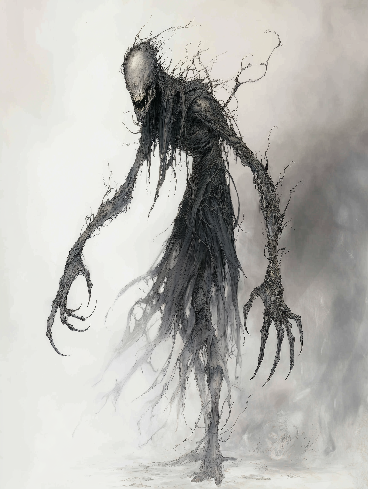

# Famine

{ align=right width="300" }

I have seen many things in my travels. I have walked through valleys where the sun was a cruel, unblinking eye, scorching the earth until it cracked like old bones. I have sat in huts where the air was so thick with fever and dust that it felt like breathing in ash. But nothing—no war, no plague, no natural disaster—holds a candle to the entity I encountered in the wastelands of the southern border. I do not speak of a man, nor a beast. I speak of the very essence of starvation, walking the earth.

It appeared not with a trumpet's blast, but with a silence. The wind simply stopped. The chirping of the locusts, the cries of the children, the rustle of the dry grass—it all ceased. The heat did not abate, but it changed, becoming heavy and oppressive, pressing against my chest like a stone slab. That was the first sign: the stillness of the grave in a place that should have been full of life.

Then, I saw it.

It was difficult to look at, not because it was blinding, but because the eyes refused to focus on it, sliding off its form like water off oil. It was tall, taller than any man, impossibly thin, a vertical slash in the fabric of reality. Its limbs were elongated, ending in fingers that looked like the twisted roots of a dead tree, grasping at nothing. It wore rags that might have once been the robes of a wanderer, now hanging in tatters that fluttered without breeze.

But it was the face that haunt me still. There was no mouth, for Famine needs no voice to scream. There were only vast, hollowed sockets where eyes should be, and yet, I felt it watching me. It saw past my skin, past my flesh, staring directly at the marrow of my bones, measuring the sustenance within. It radiated a coldness that had nothing to do with temperature; it was the chill of the empty belly, the frost of the final breath.

The ground withered beneath its feet. I watched, paralyzed by a terror I had never known, as a patch of scrub brush—brown and nearly dead already—turned gray and crumbled into dust at its mere approach. It wasn't feeding; it was negating. It was the void where life should be, walking among us.

Around it, the air shimmered with the hallucinations of the starving. I saw phantom feasts, banquets of roasted meats and cool waters, flickering in and out of existence like faulty lantern light, tempting and taunting. The entity was the center of this madness, a black hole that swallowed hope and spat out despair.

I did not run. Perhaps I was too weak. Perhaps I understood that one cannot outrun the inevitable. I simply fell to my knees, not in prayer, but in utter defeat. I felt my own strength drain, the water in my skin drying up, the bread in my stomach turning to ash. I felt the urge to consume—to eat the dirt, to gnaw on my own fingers—rising in me, a desperate, irrational madness implanted by its proximity.

And then, it moved on. It drifted past me, a shadow without a caster, seeking a place where the suffering was greater, where the life force was more concentrated to be snuffed out. It left me there, gasping in the sudden return of the hot wind, my clothes hanging heavier on my frame, my spirit shattered.

I buried the village that day. There were few bodies to bury, mostly just the memory of where they lay. But I know that what I saw was not a demon of hell, nor a spirit of the wild. It was something ancient. Something that waits patiently at the edge of existence, waiting for the harvest of souls to fail.

I write this now as a warning, and as a testament. Famine is not just a lack of bread. It is a predator. It is a walking emptiness. And God help us all, for it never, ever stops.

## [Addendum: Survivor Testimony — Village Elder Maru]

*"We had heard the stories, of course. Tales passed down from our ancestors about a being that comes when the land is dry and the people are weak. But we thought them just that—stories. When it came, we saw our crops wither in moments, our animals drop dead in the fields. People began to waste away, not from sickness, but from an emptiness that no food could fill. I saw it with my own eyes, a tall figure moving through our village, and after it passed, there was nothing left but dust and silence. We fled, leaving behind everything we had known. The hunger it brings is not just of the body, but of the soul."*

## [Analysis: Excerpt from "The Primordial Entities: A Study of Famine" by Dr. Liora Venn, Year 2034]

"[...] Famine, as an entity, represents a fundamental force of nature that transcends mere scarcity of resources. Its ability to induce not only physical starvation but also psychological despair suggests a level of influence that operates on multiple planes of existence."

"[...] The manifestations of hallucinations and the rapid degradation of organic matter in its presence indicate that Famine exerts a form of existential pressure on living beings, compelling them towards self-destruction. This phenomenon challenges our understanding of survival instincts and raises questions about the interplay between physical needs and mental states."

"[...] Understanding Famine as a living entity necessitates a reevaluation of our approaches to humanitarian crises. It is not enough to provide food and water; we must also address the deeper, more insidious effects that such an entity can impose on affected populations."

## [Insert: Famine Speaking — Audio Fragment Recovered from Survivor]

*"I am the hunger that gnaws at your bones, the emptiness that consumes your soul. In my presence, all things wither and die. You may fill your stomachs, but you cannot fill the void I bring. Embrace the nothingness, for in it, you will find release."*
