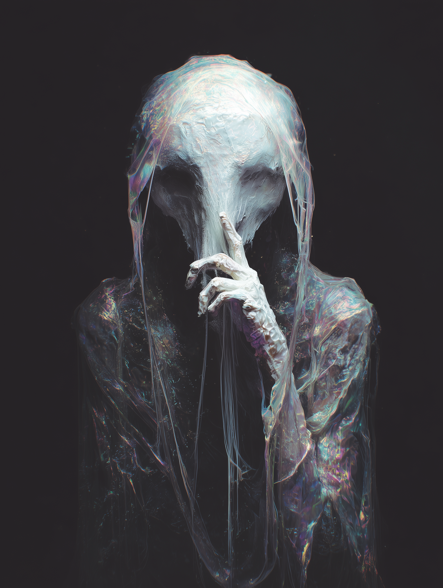

# Fate

{ align=right width="300" }

The description you are reading begins now. It could not have started at any other moment, for the threads of existence have tightened around this very instant.

You are looking for the embodiment of Fate.

She is not waiting for you; you have arrived exactly when she calculated you would.

She stands where the shadows of a thousand collapsing empires meet the light of a star that has not yet been born. She does not wear a robe of white, nor does she carry shears of silver. Those are the costumes of lesser myths. She is dressed in the fabric of 'Now'—a shifting, iridescent garment that ripples like oil on water, reflecting every face that has ever lived and every grave that has ever been dug. It has no hem, for it never ends.

Her eyes are the first thing you notice, because you were destined to notice them first. They are voids where stars go to die, yet within them burns the certainty of the next sunrise. One eye sees the line that pulls; the other sees the weight that drags. She does not blink, for to blink would be to miss the falling of a sparrow, and the falling of a sparrow is the only thing keeping the sky aloft at this precise second.

She holds no quill. She needs one not. Her fingers are long, pale things that seem to exist in more places than one. At this moment, she is tying a knot in the breath of a dying king; at this same moment, she is loosening the noose around a newborn's neck. She does not hurry. She has nowhere to be, because she is already there.

The air around her hums. It is not a sound you can hear with your ears, but a vibration in the marrow of your bones. It is the sound of every coin landing on its edge, of every arrow missing its mark by a hair's breadth, of every 'almost' and 'nearly' that history has forgotten. She breathes it in. She exhales destiny.

She is not cruel. She is not kind. She is the cliff edge; she is the gravity that pulls you down, and the wind that pushes you back. She is the reason you are reading this sentence, and the reason you will pause at the comma.

You reach out a hand. You do not know why; your hand moved of its own accord. She does not pull away. She does not reach out. She simply is, and in her being, your hand stops. You feel the roughness of her skin, and it feels like the pages of a book that has been read too many times. You feel the scar on her palm, and you know, without being told, that this is where the universe began—a cut that never healed.

She looks at you, and for the first time, you understand that you are not a person walking a path. You are the path. And she is the walker.

She smiles. It is a small, tight thing, the sort of smile one gives when a play reaches its final act and the audience is still holding its breath. She parts her lips to speak. The words she will say are not hers; they were yours before you were born.

"I knew," she says, "that you would come."

The story ends here, as it always was going to.
