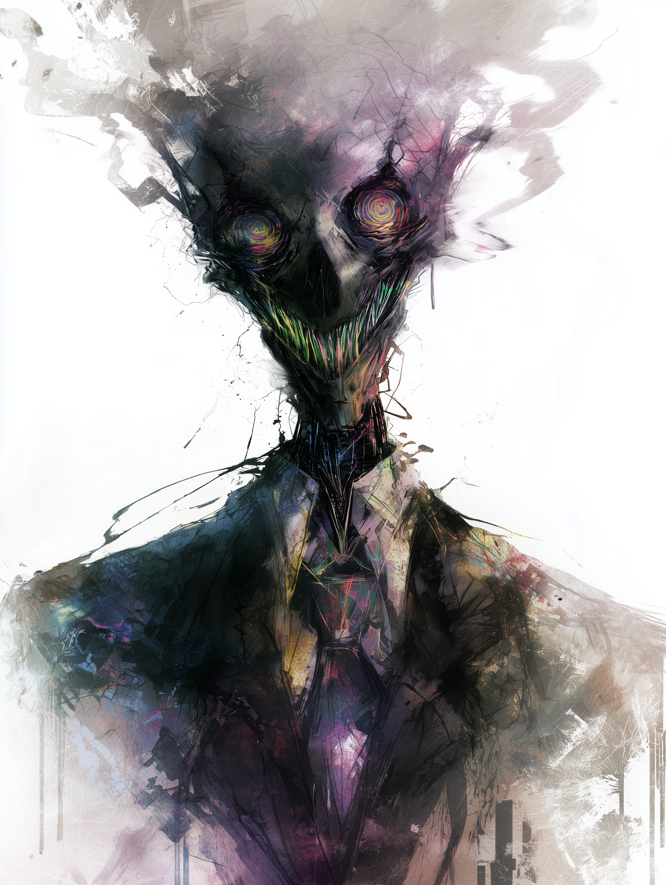

# Insanity

{ align=right width="300" }

## Patient File: 99-Alpha-Null

**Subject Designation:** The Embodiment of Insanity (Self-reports as "The Whisper," "The Static," or simply "Him").

**Attending Physician:** Dr. Aris Thorne, Head of Theoretical Psychopathology, St. Jude's Asylum for the Mentally Fractured.

### Clinical Presentation

To describe the patient known as the Embodiment of Insanity is an exercise in futility, akin to trying to capture a hurricane in a paper cup or explaining the concept of color to a creature that has only known darkness. He does not merely suffer from psychosis; he *is* the architect of it. He is the primal force that unravels the mind, the living theorem of cognitive dissonance.

Physically, he is a paradox—a silhouette that refuses to settle. When I observe him through the reinforced glass of his containment chamber, he appears as a male figure, but his dimensions fluctuate. One moment, he possesses the gangly, awkward frame of an adolescent; the next, he looms with the muscular density of a warrior, and sometimes, he simply loses his edges, becoming a smudge of graphite on the white canvas of reality. His eyes are the most disturbing feature—voids of swirling, impossible geometries that seem to contain every nightmare ever dreamed and every logic puzzle unsolved. To look into them is to feel one's own synapses misfire, to taste copper and old paper at the back of the throat.

### Symptomology & Behavior

The subject does not exhibit "moods" in the human sense. He exhibits frequencies.

* **The Acoustic Hallucination:** He speaks, but not with a mouth. His voice manifests directly in the auditory cortex of anyone within a fifty-yard radius. It sounds like a thousand radio stations tuned to dead air, occasionally resolving into a lucid, terrifyingly articulate commentary on the observer's deepest insecurities. He mocks the structure of our sentences. He repeats words until they lose all meaning—a process known as semantic satiation, weaponized.
* **Spatial Distortion:** He violates the laws of physics not with technology, but with sheer lack of belief in them. I have watched him walk through walls as if they were merely suggestions. He drinks water from a dry cup. He turns objects inside out without tearing them. He treats the hospital not as a place of containment, but as a "dreary playground" where the rules of reality are merely "guidelines for the boring."
* **The Feedback Loop:** He induces manic states in the staff. Orderlies begin to laugh hysterically while mopping floors; nurses speak in rhymes for hours at a time. It is not possession; it is infection. He accelerates the entropy of the mind. He is the virus that makes you question if the door you just opened was ever there to begin with.

### Psychiatric Evaluation

Standard diagnostic criteria—the DSM-5, the ICD-11—are rendered utterly useless in his presence. Schizophrenia? Too small a word. Bipolar disorder? Too rhythmic. He represents the fragmentation of the self before the self was even born.

He displays a manic intelligence that is terrifying. He understands the delicate balance of the human mind better than any textbook, simply because he knows exactly where to apply pressure to make it shatter. He does not hate us. That is the crucial realization. He is not malicious. He is *curious*. He treats sanity like a child treats a soap bubble: fascinated by its fragility, compelled to touch it, fully aware that his touch will destroy it.

He views the ordered world—the schedules, the medications, the routines—as a suffocating straitjacket. He sees "normalcy" as a collective hallucination that mortals have agreed upon to keep the screaming void at bay. And he is the screaming void.

### Interaction with Damien, the Eternal King

I must note a specific anomaly in his behavior, observed during the breach of Sector 4. When the entity known as Damien arrived—the so-called Eternal King, a being of terrifying power—the Embodiment of Insanity did not attack. He did not flee.

He *smiled*.

It was the first time I saw a distinct, coherent expression on his face. He looked at Damien, a being who embodies the chaos of creation and destruction, with what can only be described as familial recognition. The air in the ward grew heavy with a static that made teeth ache. The patient approached the glass, placed a hand—a hand that suddenly had too many fingers—against it, and spoke clearly for the first time.

"Cousin," he said, his voice dripping with a dark, glee. "You've brought the noise. I've brought the silence. Let's see who breaks first."

It appears that where Damien brings the Chaos that unmakes empires, the Embodiment of Insanity brings the Chaos that unmakes the *observer*. Damien destroys the world outside; this patient destroys the world inside.

### Prognosis

Incurable. Uncontainable. We are not treating a patient; we are housing a natural disaster. He is the expiration date on every thought we have ever had. He is the end of the sentence, and the period that never lands.

Do not let him out. But more importantly, do not look him in the eye. You might start to enjoy what you see.

**Signed,**
Dr. Aris Thorne
*St. Jude's Asylum for the Mentally Fractured*

## [Addendum: Interview with Survivor — Former Staff Member Lydia Crane]

*"I was an orderly at St. Jude's when they brought him in. At first, I thought he was just another patient, maybe a bit more disturbed than the others. But then... things started happening. I remember one night, I was checking on him, and he looked right at me. His eyes—they were like black holes swirling with stars. I felt this overwhelming sense of dread, like my own thoughts were unraveling. The next thing I knew, I was laughing uncontrollably in the hallway, unable to stop. They had to sedate me. When I woke up, I couldn't remember why I was laughing. He's not just insane; he *is* insanity."*

## [Analysis: Excerpt from "The Nature of Madness: A Study of the Embodiment of Insanity" by Dr. Elara Voss, Year 2029]

"[...] The entity we have come to identify as the Embodiment of Insanity challenges our fundamental understanding of mental health and cognitive function. It operates not merely as a patient with a disorder but as a force that actively dismantles the constructs of sanity itself."

"[...] Its ability to manipulate perception, induce psychosis, and distort reality suggests a level of influence that transcends traditional psychiatric frameworks. This entity does not merely suffer from mental illness; it *is* the manifestation of mental illness on a cosmic scale."

"[...] Understanding this entity requires a multidisciplinary approach, integrating psychiatry, neurology, and even quantum physics. It compels us to reconsider the boundaries of the mind and the nature of reality itself, as it exists not just within the confines of the brain but as a pervasive force that can infiltrate and dismantle the very fabric of human cognition."

## [Insert: Insanity Speaking — Audio Fragment Recovered from Containment Breach]

*"You think you understand your mind? Ha! I am the crack in your thoughts, the static in your signal. I am the whisper that tells you to doubt your own reality. Embrace the chaos within, for it is the only truth. Sanity is a lie we tell ourselves to avoid the abyss. But I am the abyss, and I am always listening."*