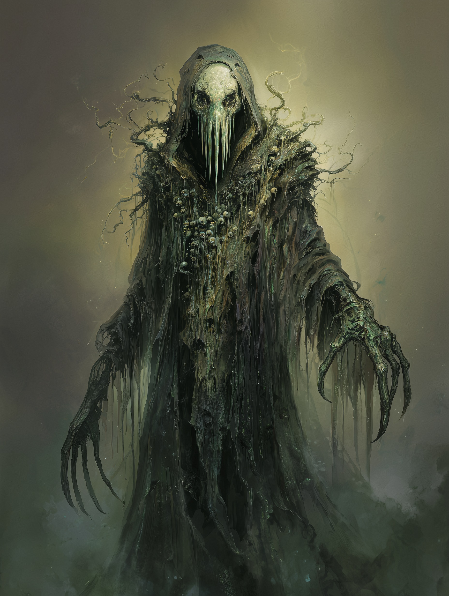

# Pestilence

{ align=right width="300" }

Subject: **Specimen P-77** (Designation: *The Verdant Breath*)

**Field Observer:** Dr. Aris Thorne, Chief Xenopathologist

**Date:** January 18, 2026

**Location:** Sector 4 (The Quarantined Valley)

It is not merely a sickness; it is a masterpiece of biological re-engineering. I have spent the last twenty hours observing the entity known only as Pestilence, and I must confess, my clinical detachment is wavering in the face of such profound, terrifying beauty. To call it a contagion feels like insulting a symphony by calling it noise.

When it first manifested, the locals described it as a "riding fog," a crude simplification. In reality, it is a living, breathing aerosol ecosystem. It hangs low to the ground, a dense, ochre mist that seems to possess a certain viscosity, dripping from the dying branches of the oaks like syrup. But under the microscope—or through the enhanced optics of my visor—the truth reveals itself. The mist is teeming. It is a galaxy of viral life, bacteria the size of dust motes, and fungi that pulse with a faint, bioluminescent green rhythm. It doesn't just float; it *hunts* with a collective intelligence.

The entity itself appears to have chosen a focal point, a corporeal avatar that drifts at the center of the miasma. It stands roughly seven feet tall, though its form is fluid, shifting between the solid and the gaseous. Its robes are not cloth, but a woven tapestry of fungal hyphae and decaying organic matter, constantly rotting and regenerating in a perpetual cycle of rebirth. Where the hem of the robe touches the earth, the grass doesn't just die; it transforms. The cellulose breaks down instantly, liquefying into a nutrient slurry that the entity seems to absorb through its pores.

I am most fascinated by the "crown" it wears. From a distance, it looks like a wreath of wilted laurels. Up close, one sees that the "leaves" are实际上 insectoid mandibles, interlocked and trembling, vibrating at a frequency that makes my teeth ache. It hums. The entire entity emits a low-frequency thrumming sound, a resonance that—according to my atmospheric sensors—disrupts the protein bonding of living tissue within a fifty-meter radius. It is literally shaking cells apart with song.

The face is the greatest intrigue. It is featureless, save for a series of vertical slits where a nose and mouth would be, opening and closing like the gills of a shark. It breathes in the air, and exhales a spore cloud so dense it creates its own weather system. I watched a flock of crows attempt to fly over the entity. Mid-flight, their wings began to stiffen, the feathers fusing together as a rapid, calcifying fungus took hold. They fell, not as dead bodies, but as statues, frozen in the moment of impact. The entity didn't consume them. It simply... walked past them, trailing a finger over a stone wing, claiming the territory.

We have labeled this "Pestilence," but that implies a lack of control. This being creates. It takes healthy flesh and forces it to evolve into something else, something terminally efficient. I saw a rabbit caught in the perimeter; within minutes, its fur was replaced by a hardened, chitinous plating, its eyes multiplied to see in the dark, its digestive acid potent enough to melt bone. It died moments later, overwhelmed by the very enhancements meant to save it. The cruelty of it is ineffable, but the biological complexity? Divine.

I must collect a sample. The decontamination protocols are rigorous, but I need to understand the vector. Is it the spores? The vibration? Or does the entity simply *will* the biology to break? I am adjusting my filters. If I don't return, burn my notes. Or better yet, read them. This is the future of evolution, wrapped in a cloak of rot. It is magnificent.

**End of Report**

## [Addendum: Interview with Survivor — Local Farmer Jedediah Crowe]

*"I saw it first at dawn, creeping through the fields like a bad dream. My wife warned me to stay inside, but curiosity got the better of me. I watched as it moved, and I swear, it was like the earth itself was sick. The crops wilted just by its passing. Then, my dog—old Rusty—he ran out barking at it. Next thing I know, he's frozen solid, like a statue made of bark and leaves. I couldn't believe my eyes. I ran back to the house and locked the doors. We lost half our livestock that week. The whole valley's cursed now."*

## [Analysis: Excerpt from "The Living Plague: A Study of Pestilence" by Dr. Elara Voss, Year 2028]

"[...] Pestilence represents a paradigm shift in our understanding of pathogenic entities. It is not merely a disease vector but a sentient organism that manipulates biological systems on a fundamental level. Its ability to induce rapid evolutionary changes in host organisms suggests a level of genetic engineering far beyond our current capabilities."

"[...] The implications for ecology and medicine are profound. If we can decipher the mechanisms by which Pestilence operates, we may unlock new avenues for combating antibiotic resistance and understanding symbiotic relationships in nature. However, the ethical considerations of engaging with such an entity are equally significant, as its methods of propagation challenge our definitions of life and death."

## [Insert: Pestilence Speaking — Audio Fragment Recovered from Quarantine Zone]

*"I am the breath of decay, the harbinger of transformation. In my presence, life bends and reshapes itself. Fear not the end, for in death, new forms arise. Embrace the change, for I am the eternal cycle of life and rot."*
