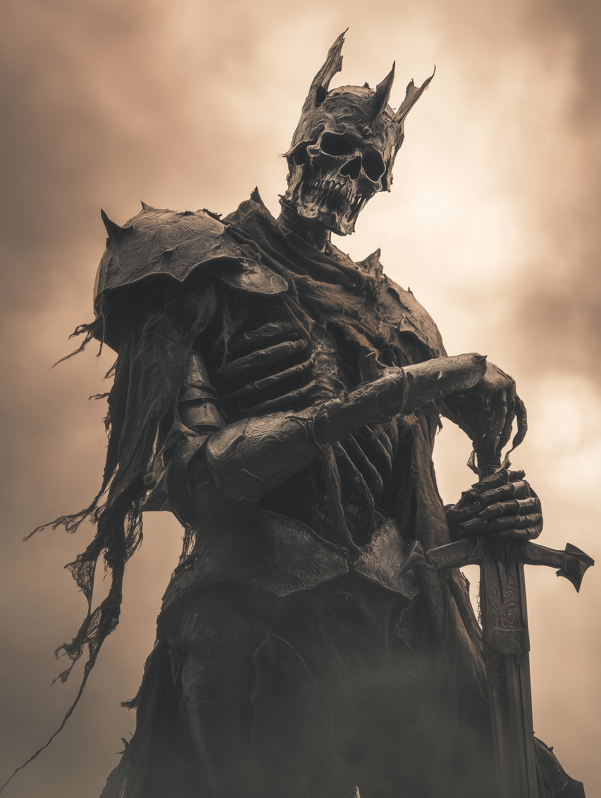

# War

{ align=right width="300" }

To understand War is not to understand the clash of steel or the thunder of cannon fire. No, those are merely the symptoms, the noise of the beast. To truly understand War, you must look past the smoke, past the rubble, and gaze into the cold, unyielding eyes of the entity that orchestrates the slaughter. I have spent forty years studying the art of conflict, dissecting the great battles of history from the phalanxes of Marathon to the trench networks of the Somme, and I have come to a singular, terrifying conclusion. War is not a concept. It is not a political tool. It is a living, breathing monstrosity.

I first felt its gaze upon me during the Siege of Vora. It was not in the heat of the charge, but in the terrible silence of the strategic pause, when the maps were spread out and the calculations were being made. The air grew heavy, tasting of copper and ozone. The embodiment of War does not arrive with the fanfare of trumpets; it arrives with the suffocating pressure of absolute certainty.

It does not have a single face, for War wears the visage of every enemy you have ever feared. Sometimes it appears as a towering general clad in armor that seems to be forged from the iron of a thousand shattered swords, a scarlet cloak draped over shoulders that have borne the weight of genocide. At other times, it is a shadow in the corner of the war room, a whisper in the ear of a hesitant ruler, urging the strike that will doom millions.

Its presence is a distortion of reality. Where it walks, logic fractures. The brilliant flanking maneuver you calculated for hours collapses into chaos because War *wills* it to be chaotic. It thrives not on the victory, but on the struggle. It feeds on the friction—the fog of war that Clausewitz spoke of is not a metaphor; it is the breath of this entity. It exhales confusion and inhales order, leaving only the raw, brutal struggle for survival in its wake.

I have seen its eyes. They are the most terrifying aspect of all. There is no malice in them. Malice implies a passion, a reason for cruelty. War has no reason. It simply *is*. Its eyes are empty, reflecting only the fire of burning cities and the pale faces of the dead. To look into them is to see the mathematical perfection of extinction. It analyzes us not as combatants, but as variables in an equation where the solution is always zero.

It is the master tactician beyond all human capability. Where I see a risk, it sees an inevitability. Where I see a tragedy, it sees a statistic. It understands that the morale of a troop is a brittle thing, a glass hammer to be shattered at the precise moment to maximize despair. It conducts the symphony of violence with a baton made of bone, directing the movements of armies as if they were mere puppets on a stage of corpses.

War is old. Older than the first stone hurled in anger. It remembers the spear-thrusts of the caveman and the nuclear shadows of the future. It is patient. It can lie dormant for decades, letting civilizations believe they have achieved peace, lulling them into a complacent stupor. And then, with a single spark—an assassination, a treaties violation, a misunderstood word—it breathes in, and the world catches fire.

To face War is to face the ultimate realization of your own insignificance. You may be a grand general, a master of strategy, a hero of the people. But to War, you are merely fuel. You are the conductor of its orchestra, playing a score written in blood. And the greatest horror, the one that keeps me awake at night in the quiet of my study, is the realization that War enjoys the music. It doesn't care who wins. It only cares that the music never stops.

## [Recovered Transcript: Field Report from Captain Elara Voss — Battle of Vora, Year 2147]

The enemy forces are advancing on our position. Our scouts report heavy artillery and mechanized infantry. We are outnumbered and outgunned, but we will hold this line for as long as we can.
Suddenly, the air grew thick, like a storm was about to break. Our soldiers reported feeling an overwhelming sense of dread, as if the very concept of war had taken form and was watching us.
Then, amidst the chaos, I saw it. A figure, towering and clad in armor forged from the remnants of countless battles. Its eyes were empty voids, reflecting the flames of destruction around us. It moved with purpose, and wherever it went, our strategies fell apart. Our troops became disoriented, our formations crumbled, and our morale shattered.
We fought on, but it was as if we were battling not just the enemy, but the very essence of war itself. The figure seemed to revel in the chaos, orchestrating the destruction with a cold, calculating precision.
In the end, we were forced to retreat. The losses were staggering, and I fear that this entity will continue to haunt our battles. It is not just a force of nature; it is a living embodiment of war, and it will not rest until all is consumed by conflict.

## [Analysis: Excerpt from "The Entities of Conflict" by Dr. Marcus Lorne, Year 2152]

"[...] the entity we have come to identify as 'War' is not merely a metaphorical construct but a tangible presence that influences the outcomes of conflicts on a fundamental level. Its ability to manipulate the perceptions and strategies of military leaders suggests a level of intelligence and intent that transcends human understanding."

"[...] War does not discriminate; it affects all sides equally, turning allies into enemies and friends into foes. Its presence is marked by a sudden shift in the dynamics of battle, where well-laid plans unravel and chaos reigns supreme."

"[...] Understanding War as a living entity challenges our traditional notions of conflict and compels us to reconsider our approaches to diplomacy and peacekeeping. If we are to mitigate its influence, we must first acknowledge its existence and the profound impact it has on the course of human history."

## [Insert: War Speaking — Audio Fragment Recovered from Battlefield]

*"I am not your enemy, nor your ally. I am the inevitability that binds you all. In your struggle, I find purpose. In your despair, I find sustenance. You may fight me, but know this: I am eternal. As long as there is conflict, I will endure. Embrace me, for resistance is futile."*
